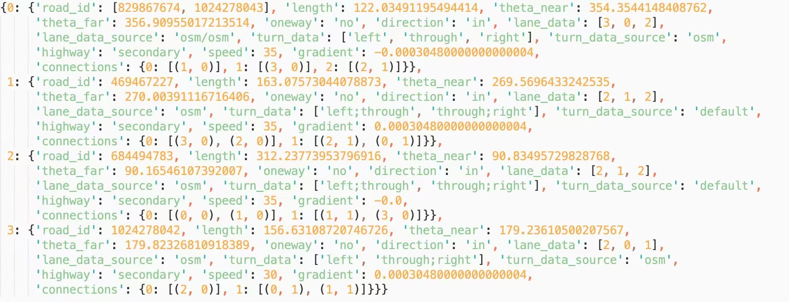

# OSMint

This is a Python package for extracting signalized intersections from OpenStreetMap. We use Overpass API to collect raw data about traffic signals, road segments, and turn restrictions from OpenStreetMap. Then, the package generates a signalized intersection dataset through a pipeline with imputation mechanisms for various missing values (lane count, speed limit, turns, gradient, etc) and algorithms for detecting turns and combining one-ways that should have been a divided two-way. An example output for representing a road intersection is shown below.


## Installation
Please run the following command in terminal to install the package and other dependencies.
```
$ pip install OSMint
```

## Example Usage
To generate the signalized intersection dataset for a specified region:
```python
from OSMint import get_data
city = "Salt Lake City"
state = "UT"
intersections = get_data(city, state)
```
We provide a sumo converter to convert the collected intersections into sumo files to support various applications:
```python
from OSMint.sumo import gen_sumo
output = "sumo/" # enter the directory for storing sumo files
gen_sumo(intersections, output)
```
